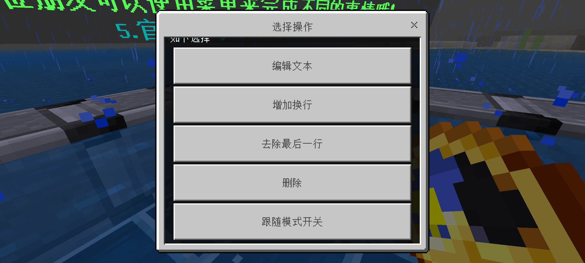
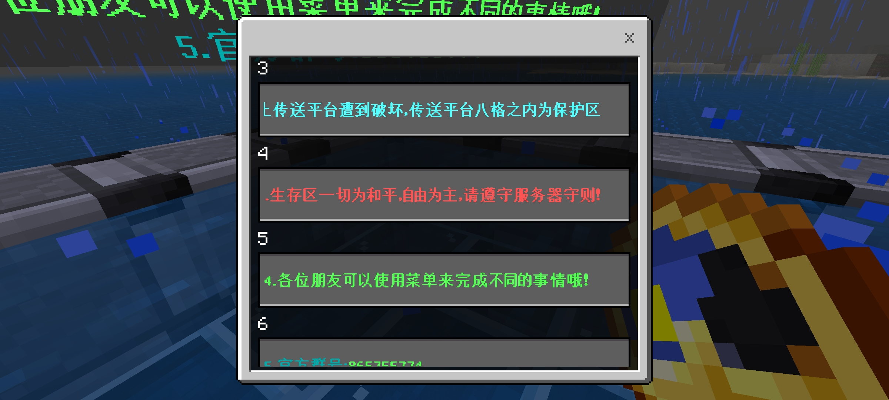

## 【LLSE】FloatWord 悬浮字插件

#### 跨版本 JS插件（易修改）有GUI方便使用 无配置文件方便可用

---
作者QQ：3485453922 插件可以找他议价单独购买
演示视频B站链接[还没发布]()

---
### 成品图

---

### 使用步骤(仅管理员)

1. 使用指令`/fw`创建一个~~废物~~盔甲架状态的悬浮字
2. 点击（不是长按）悬浮字下方一点的地方打开设置界面（如下）

3. 进行设置（如下）

4. 重启服务器使得悬浮字退出盔甲架状态（这步以后仍然可以同样进行设置）

---
###  特色功能

1. 跟随模式：启动后，悬浮字会跟随你移动，再也不用输入坐标啦
2. 复制：方便多个相同悬浮字，也可以用于悬浮字内容提取

---
一些缺点：
1. 悬浮字会吸引怪物攻击（悬浮字有一部分玩家的属性）可以用方块隔离
2. 需要重启服务器（而不是退出重进）才能退出盔甲架状态，有点麻烦